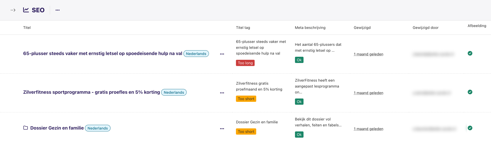

# Wagtail SEO Report

[](https://pypi.python.org/pypi/wagtail-seo-report/)

A custom SEO report for you Wagtail pages.



## Requirements

- Wagtail >= 6

## Settings

Overwrite this setting in order to extend the report with custom fields:

```python
WAGTAIL_SEO_REPORT_VIEW = "wagtail_seo_report.views.WagtailSEOReportView"
```
